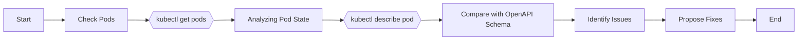

```markdown
# Kubernetes Troubleshooting Guide
This document aims to provide comprehensive guidance on identifying and resolving potential failures or performance optimization opportunities in Kubernetes resources. 

## Table of Contents

- [Schema Comparison](#schema-comparison)
- [Identifying Issues and Performance Optimizations](#identifying-issues-and-performance-optimizations)
- [Kubectl Commands](#kubectl-commands)
- [Flowchart](#flowchart)

## Schema Comparison  
We use the OpenAPI schema definitions to compare the expected state to the current state of the Kubernetes resources. Upon finding discrepancies, here is an example:

```yaml
# This is the expected schema from OpenAPI definition
kind: Pod
metadata:
  name: my-pod
spec:
  containers:
  - image: nginx
    name: my-pod
...

# This is your current resource state
kind: Pod
metadata:
spec:
  containers:
  - image: nginx
    name: my-pod
...
```
In the above code, the `metadata.name` field is missing in your current resource state. According to Kubernetes OpenAPI definition:

> "metadata.name" uniquely identifies a resource within its namespace.

## Identifying Issues and Performance Optimizations
We can point out potential issues and improvements by analyzing resource definitions in YAML format, container logs, and Prometheus metrics. 

```yaml
# Here is a pinpointed area of concern
kind: Pod
metadata:
  name: my-pod
spec:
  containers:  
  - image: busybox   # Using busybox image could lead to performance issue
    name: my-pod
```

## Kubectl Commands
To understand the current state of Kubernetes resources, execute the following steps:

1. Run the command `kubectl get pods` to list all the pods.
2. Use command `kubectl describe pod <POD_NAME>` to get detailed information about a specific pod.

## Flowchart  
Below is a Mermaid flowchart outlining the troubleshooting procedure:



Each block represents an actionable step in the troubleshooting process.

## Conclusion  
By following this guide, you should have a crisper understanding of your Kubernetes resources, and the corrective steps to be taken for resolving the issues and potential performance improvements.

```

**Note:** Replace `<POD_NAME>` with the name of your pod for a specific solution.