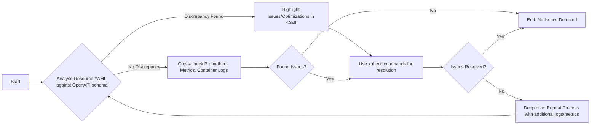

# Kubernetes Resource Troubleshooting Guide 

This comprehensive guide will walk you through the process of identifying potential issues in Kubernetes resources and their resolution methodologies with possible performance optimizations.

## Analyzing Kubernetes Resources via openAPI schema 

An essential step to troubleshooting any resource is making sure it is defined correctly. You can use OpenAPI schema definitions to inspect the structure and constraints of your Kubernetes resources against their expected form.

Let's take a dummy Kubernetes resource described in YAML format:

```yaml
# Dummy Kubernetes Resource

apiVersion: apps/v1
kind: Deployment
metadata:
  name: app-deployment             #<<--1
...
```
<sub> _Hint: Pay special attention to the metadata name (annotated with "--1") as it should be unique within a namespace._ </sub>

## Identifying Issues and Offering Optimizations 

If there are unexpected behaviors or issues within the Kubernetes resources, you can explicitly highlight it within the YAML definitions using comments or annotations. 

For this, review the existing OpenAPI schema and identify discrepancies. The comparison would sound like this: 

```
According to the OpenAPI schema, the 'metadata.name' should be a string with a maximum length of 253 characters, starting and ending with an alphanumeric character. 

However, in the yaml defined above 'metadata.name' is exceeding that limit which may cause issues. 
```

## Useful kubectl commands 

> `kubectl describe deployment app-deployment`

This command will help confirm if our deployment is working as expected. Watch for messages about lack of resources, errors in the image name, etc.

## Refining Existing Documentation 

When adjusting existing content, the markup formatting should be preserved and prior instruction should be enhanced rather than rewritten. 

## Mermaid Flowchart 

The following chart describes the process of identifying and addressing problems in Kubernetes resources.



This chart provides an understanding of the workflow for troubleshooting and optimizing Kubernetes resources. Follow this guide step-by-step for a seamless solution.