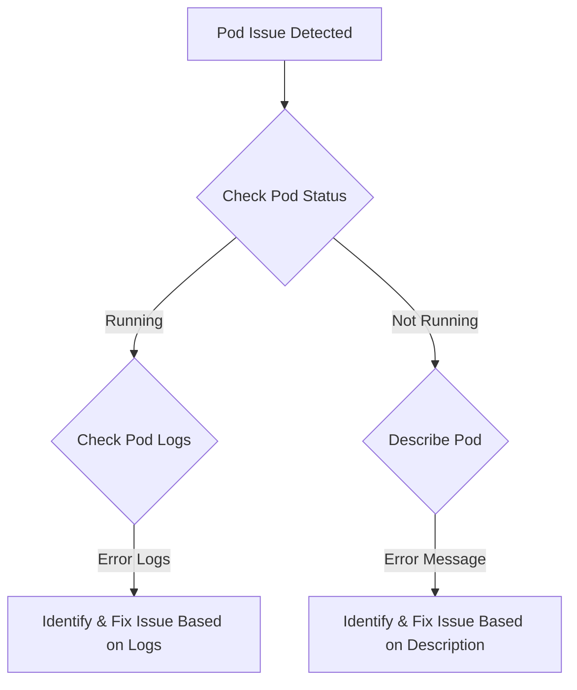

# Kubernetes Troubleshooting Guide

## Introduction and Objectives
This guide focuses on providing troubleshooting steps for Kubernetes resources. This will guide the user in identifying potential issues, performance improvements, and steps towards resolving the encountered problems.

## Analysis of Available Information
As no specific information regarding the Kubernetes resources, events or metrics are provided, this section will cover general analysis based on typical Kubernetes operations.

A variety of Kubernetes troubleshooting scenarios would involve the followings:
- Issues with deploying an application.
- Pod scaling issues.
- Service is not accessible.
- Resource quota exceeded.
- Inspecting the events of a namespace.
- Checking health of the different workload resources (Pod, Deployment, StatefulSet, DaemonSet, etc.).
- Issues with Persistent Volumes.

## Identified Issues and Recommendations
Here are some common issues and recommended solutions:

1. **Issue:** Pod not running
    - **Recommendation:** Check Pod status using `kubectl get pods`. Identify and fix the root cause based on error messages from `kubectl describe pod <pod-name>` or Pod logs using `kubectl logs <pod-name>`.

2. **Issue:** Service not accessible
    - **Recommendation:** Validate service using `kubectl get svc <service-name>`. Make sure the Service is associated with the correct target Port and Pod selector. Test connectivity to the Service from within the cluster using tools like `curl` or `wget`.

3. **Issue:** Resource quota exceeded
    - **Recommendation:** Identify the current resource usage using `kubectl describe quota`. Increase the quota limit if required, or identify potential resources that can be reduced or removed.

## Step-by-Step Troubleshooting Guide
Useful `kubectl` commands for identifying and resolving issues:

1. To check all the Pods within a namespace use: `kubectl get pods -n <namespace>`.
2. To describe a Pod for detailed information use: `kubectl describe pod <pod-name> -n <namespace>`.
3. To check logs of a Pod use: `kubectl logs <pod-name> -n <namespace>`.
4. To execute commands within a container use: `kubectl exec -it <pod-name> -n <namespace> -- <command>`.
5. To check all PersistentVolumes use: `kubectl get pv`.
6. To describe a PersistentVolume for detailed information use: `kubectl describe pv <pv-name>`.

## Mermaid Flowchart (If Applicable)
Since this is a generalized guide based on hypothetical scenarios, here is a flowchart summarizing the steps for troubleshooting Pod issues:

## Conclusion
The purpose of this guide is to provide a broad overview of troubleshooting techniques for Kubernetes. Although it is impossible to cover all scenarios, it covers the basics most commonly used. Examples of commands, typical problem scenarios, and their solutions should provide a general direction during the problem approach. This guidance's applicability will largely depend on the specific problem context and Kubernetes cluster architecture.

*This document contains information generated by OpenAI's ChatGPT. This AI-generated content has not been independently verified and should be cross-checked against reliable sources.*
